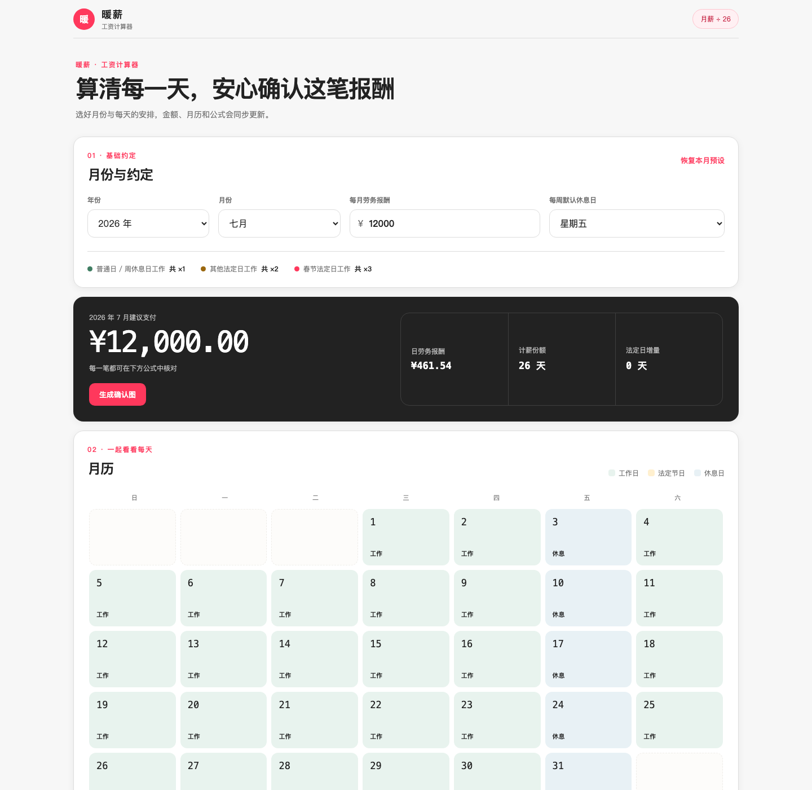

# 暖薪 · 工资计算器

**Warm Wage · Salary Calculator for Household Workers**

[中文说明](#中文说明) · [English](#english) · [在线体验 / Live Demo](https://lalabear.top/salary-calculator)



---

## Personal home / 个人首页

The root page uses the public alias LALABEAR, with no personal name or employer history. It introduces observations and the personal stories behind Warm Wage and ROUNDO, rather than a resume layout. Chinese is the default; `/?lang=en` opens the English edition. The language switch preserves the section anchor and stores the selection in the URL, not the calculator's local state. No portrait, private interview metrics, or unconfirmed hobbies are included.

根页面使用公开网名 LALABEAR，移除个人名字、具体雇主与履历组合。使用独立的 `home.css`、`home.js` 和个人标记，不改变计薪样式、逻辑、存储或研究页面代理。暖薪入口保留在 `/salary-calculator`（本地静态服务器使用 `/salary-calculator.html`）。

标记使用两个不同颜色的端点和一条有转折的连接线，表达理解不同视角、寻找共同路径并促成行动；不是星星装饰。母版为 `assets/lalabear-mark.svg`，页头、首页、页尾和 favicon 共用。网名不保证匿名：现有域名、产品链接、代码托管账号和历史内容仍可能关联现实身份；这轮未修改远端历史或其他网站。

首页支持原生章节链接、键盘操作、可展开的设计理念及 reduced-motion。用现有 `npm test` 运行首页与计薪回归检查。

Vercel serves this dependency-free static site from the repository root. Deployment runs `npm test` as its validation step; no generated build directory or `npm run build` script is required. Local Vercel configuration and environment credentials must remain untracked.

## 中文说明

暖薪是一个面向家庭劳务工作者与雇主的开源工资计算器。它把每月的工作、休息和法定节假日安排放进一张清晰的月历，并按照约定的日劳务报酬与节日倍数计算实际应付金额。

所有计算都在浏览器本地完成，不需要注册，也不会把工资或日历数据上传到服务器。

### 主要功能

- 月薪默认为人民币 12,000 元，日劳务报酬按 `月薪 ÷ 26` 计算
- 月历从星期日开始，分别标记工作日、休息日和法定节日
- 默认每周星期五休息，也可以选择其他星期
- 每一天都可以设置为全天休息、工作半天或工作一天
- 日期性质支持普通日、其他法定日和春节法定日
- 自动列出应付金额、计薪份额、节日增量和完整公式
- 一键生成工资确认图，可复制到剪贴板或下载 PNG 后转发确认
- 支持 2026–2030 年，并允许逐日调整未来安排
- 自动兼容旧版保存在浏览器中的“休息日”设置

### 当前计薪约定

日劳务报酬：

```text
日劳务报酬 = 月薪 ÷ 26
```

普通日及每周休息日：

```text
实际工作份额 × 1
```

其他法定节日：

```text
法定带薪 1 份 + 实际工作份额 × 1
全天工作共 ×2，半天工作共 ×1.5
```

春节四个法定日：

```text
法定带薪 1 份 + 实际工作份额 × 2
全天工作共 ×3，半天工作共 ×2
```

法定节日放假时仍计 1 份带薪报酬。调休形成的连休日期不会自动获得法定节日倍数。

### 法定节日范围

项目依据中国大陆现行《全国年节及纪念日放假办法》预置：

- 元旦 1 天
- 春节 4 天（除夕、正月初一至初三）
- 清明节 1 天
- 劳动节 2 天（5 月 1 日、2 日）
- 端午节 1 天
- 中秋节 1 天
- 国庆节 3 天（10 月 1 日至 3 日）

2027–2030 年的农历节日按历法预置。年度放假和调休通知可能变化，请在正式结算前核对当年的政府通知，并利用逐日调整功能修正安排。

### 本地运行

无需安装前端依赖：

```bash
python3 -m http.server 4173
```

然后打开 `http://localhost:4173`。

运行计算测试：

```bash
npm test
```

### 项目结构

```text
index.html          双语个人首页
home.css / home.js  首页样式与语言切换
salary-calculator.html  计薪页面结构
styles.css          响应式视觉样式
app.js              页面交互与本地状态
calc.mjs            节日数据与计薪核心
share-image.mjs     确认图生成与导出
test/               核心计算测试
```

### 隐私

- 工资、日期安排和调整记录仅保存在当前浏览器
- 项目没有后端数据库或用户账户
- 复制图片需要浏览器剪贴板权限；不支持时可以下载 PNG

### 免责声明

本项目用于依据双方约定进行工资核对和沟通，不构成法律、劳动用工、税务或财务建议。不同地区、合同性质和用工关系可能适用不同规则，请在需要时咨询专业人士。

---

## English

Warm Wage is an open-source salary calculator for household workers and employers. It turns monthly work, rest days, and statutory holidays into a clear calendar and calculates the payment due under a configurable daily-rate and holiday-multiplier agreement.

All calculations happen locally in the browser. No account is required, and salary or calendar data is never uploaded to a server.

### Features

- Defaults to a monthly salary of CNY 12,000 and a daily rate of `monthly salary ÷ 26`
- Sunday-first monthly calendar with distinct workday, rest-day, and statutory-holiday states
- Friday as the default weekly rest day, configurable to any weekday
- Full-day rest, half-day work, or full-day work for every date
- Day types for regular days, other statutory holidays, and Spring Festival statutory holidays
- Transparent payment total, paid-day equivalents, holiday premiums, and formulas
- Shareable confirmation image with clipboard copy and PNG download
- Calendar support for 2026–2030 with per-day overrides
- Automatic migration of rest-day choices saved by earlier versions

### Calculation model

Daily service rate:

```text
daily rate = monthly salary ÷ 26
```

Regular days and weekly rest days:

```text
actual worked fraction × 1
```

Other statutory holidays:

```text
1 paid statutory-leave unit + actual worked fraction × 1
full-day work totals ×2; half-day work totals ×1.5
```

Four Spring Festival statutory holidays:

```text
1 paid statutory-leave unit + actual worked fraction × 2
full-day work totals ×3; half-day work totals ×2
```

A statutory holiday taken as leave still contributes one paid unit. Extended breaks created through adjusted workdays do not automatically receive statutory-holiday multipliers.

### Holiday scope

The built-in calendar follows the current Mainland China statutory-holiday scope:

- New Year's Day: 1 day
- Spring Festival: 4 days (Lunar New Year's Eve through the third day)
- Qingming Festival: 1 day
- Labour Day: 2 days (May 1–2)
- Dragon Boat Festival: 1 day
- Mid-Autumn Festival: 1 day
- National Day: 3 days (October 1–3)

Lunar holidays for 2027–2030 are calendar-based presets. Official annual holiday and adjusted-workday schedules may change, so verify the applicable government notice before final payment and use the per-day controls when needed.

### Run locally

No frontend dependency installation is required:

```bash
python3 -m http.server 4173
```

Open `http://localhost:4173`.

Run the calculation tests:

```bash
npm test
```

### Privacy

- Salary and calendar adjustments stay in the current browser
- There is no backend database or user account
- Image copying requires browser clipboard permission; PNG download is available as a fallback

### Disclaimer

This project supports payment review and communication under a specific agreement. It is not legal, employment, tax, payroll, or financial advice. Applicable rules may vary by location, contract type, and working relationship.

## Contributing

Issues and pull requests are welcome. Please include tests when changing calculation logic, holiday dates, or multiplier behavior.

## Site routing

This repository owns the `lalabear.top` homepage and the `/salary-calculator` page. Research projects are maintained independently and exposed under `/work/studies/` through Vercel rewrites, so each study can keep its own source, release history, and deployment lifecycle.

## License

[MIT](LICENSE)
